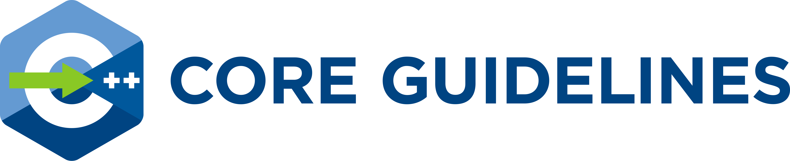

# [C++ 核心指导方针](http://lynnboy.github.io/CppCoreGuidelines-zh-CN/CppCoreGuidelines)

>"Within C++ is a smaller, simpler, safer language struggling to get out."
>-- <cite>Bjarne Stroustrup</cite>

[《C++ 核心指导方针》（The C++ Core Guidelines）](CppCoreGuidelines.md)，与 C++ 语言本身一样，是由 Bjarne Stroustrup 领导的协作项目。
该指导方针是许多组织和团体之间耗费了大量人年的探讨和设计的心血成果。它们的设计着眼于普遍的适用性并鼓励广泛采纳，
但您也可以对其进行随意的复制和修改，以满足您的团体组织自身的需要。

## 起步

指导方针内容见 [CppCoreGuidelines](CppCoreGuidelines.md)。该文档为 [GH 风格 MarkDown 格式](https://github.github.com/gfm/)。我们有意维持文档简单，（英文原版）基本上是 ASCII，以便于进行诸如语言翻译和格式转换之类的自动化后处理。
编写者们还维护了[一个适于浏览的版本](http://lynnboy.github.io/CppCoreGuidelines-zh-CN/CppCoreGuidelines)。请注意它由人工集成，因而可能略晚于 master 分支的版本。
[英文原版](http://isocpp.github.io/CppCoreGuidelines/CppCoreGuidelines)。

这些指导方针是持续不断演进的文档，并且没有严格的“发布”节奏。Bjarne Stroustrop 定期评审文档并增加导言部分的版本号。[增加版本号的签入](https://github.com/isocpp/CppCoreGuidelines/releases) 都在 git 中打了标签。

其中有不少都用到了纯头文件的 Guidelines Support Library（指导方针支持库）。有一个实现在 [GSL：Guidelines Support Library](https://github.com/Microsoft/GSL)。

## 背景和领域

这个指导方针的目标是帮助人们更有效地运用现代 C++ 语言。所谓“现代”的含义是指 C++11 和更新的版本。
换句话说，如果你从现在开始算起，五年后你的代码看起来是怎么样的？十年呢？

指南所关注的是一些相对比较高层次的问题，比如接口，资源管理，内存管理，以及并发等等。这样的规则会对应用的架构
以及程序库的设计都造成影响。如果遵循这些规则，代码将会是静态类型安全的，没有资源泄露，并且能够捕捉到比当今的代码
通常所能捕捉到的多得多的编程逻辑错误。还能更快速地运行——你不必牺牲程序的正确性。

我们对于如命名约定和缩进风格一类的低层次的问题不那么关注。当然，对程序员有帮助的任何话题都是可接受的。

我们最初的规则集合强调的是（各种形式的）安全性以及简单性，它们有些过于严格了。我们预期将会引入更多的例外情况，
以便使它们更好地适应现实世界的需要。我们也需要更多的规则。

您可能会发现，有的规则与您的预期相反，甚至是与您的经验相违背。其实如果我们没建议您在任何方面改变您的编码风格，
那其实就是我们的失败。请您尝试验证或者证伪这些规则吧！尤其是，我们十分期望让一些规则能够建立在真实的测量数据上，
或者是一些更好的例子之上。

您可能会觉得一些规则很显然，甚至没有什么价值。但请记住，一份指导方针的目的之一就在于帮助那些经验不足的，或来自其他
背景或使用其他语言的人，能够迅速行动起来。

指导方针中的规则有意设计成可以由分析工具提供支持的。违反规则的代码会打上标记，以引用（或者链接）到相关的规则。
您在开始编码前并不需要记住所有这些规则。

这些规则都是为了逐步引入一个代码库而设计的。我们计划建立这样的工具，并希望其他人也能提供它们。

## 贡献与授权

十分欢迎大家提出意见和改进建议。随着我们的知识增长，随着语言和可用的程序库的改进，我们计划对这份文档不断进行修改和扩充。
更多细节请见 [CONTRIBUTING](./CONTRIBUTING.md) 和 [LICENSE](./LICENSE)。

感谢 [DigitalOcean](https://www.digitalocean.com/?refcode=32f291566cf7&utm_campaign=Referral_Invite&utm_medium=Referral_Program&utm_source=CopyPaste) 存放标准 C++ 基金会网站。
